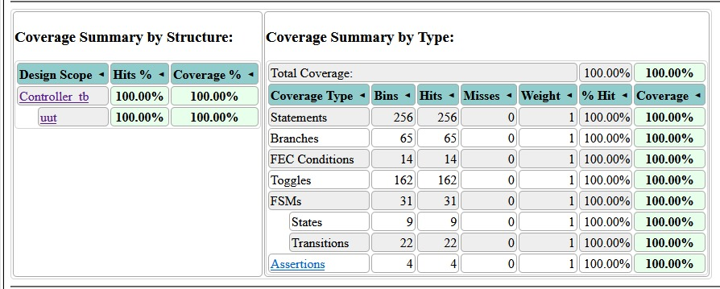

# Washing Machine Controller Project

This repository contains the Verilog implementation of a **Washing Machine Controller**. It includes a hierarchical design with a focus on modularity, testability, and reusability.

## Features
- **Timer Module:** Controls the timing for different washing machine cycles.
- **Controller Module:** Manages cycle states, inputs, and outputs.
- **Testbench:** Comprehensive test coverage using the provided testbench.

## Coverage Report
